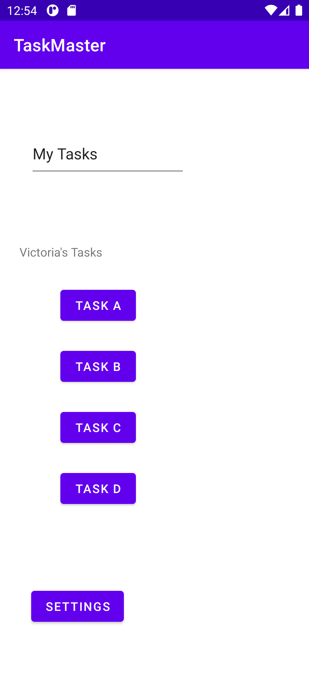
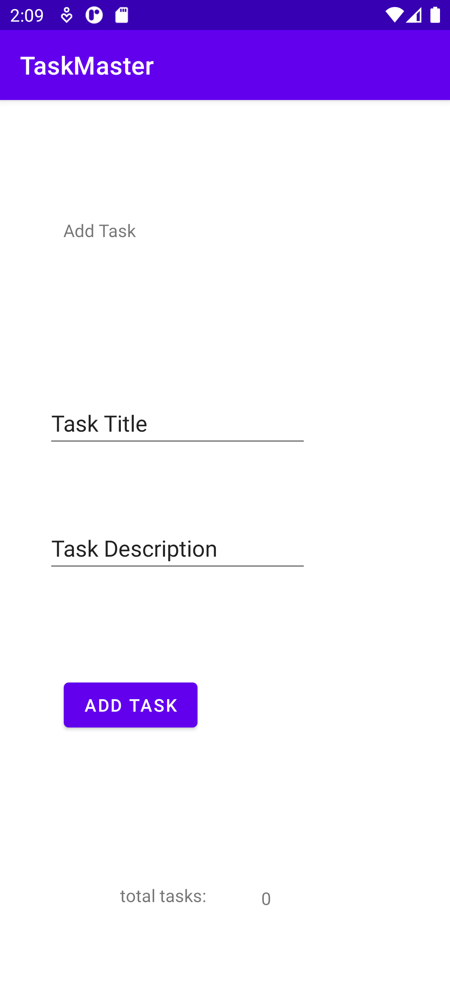

# taskmaster

## Lab-31 - 5.Sep

Adding UI test using Espresso API 

## Lab-29 - 1.Sep

1. Adding the tasks buttons dynamically based on user's input / notice the total tasks number at the bottom of the scren

2. Adding The Task info and clicking add will redirect us to home again 

3. By clicking on the newly added assignment

4. Navigate to the Add Task page and notice the total task number

## Lab-28 - 31.Aug

1. Add Recycler view to the home page to view multiple tasks as buttons

2. When clicking on one of the tasks, it will navigate you to the detail task page and details for the clicked task will be viewd.

When clicking on button Task A

When clicking on button Task C

## Lab-27 - 30.Aug

1. Home Page containing 3 tasks(task buttons) Each button reffering to a task + a settings button.

.

2. Each Task should pass it's name to the Task Detail Page as a title

.
.
.

3. The Settings Page should ask the user to enter his name , that will be passed to the home page and viewed there.

.
.
.

## Lab-26 - 29.Aug

Adding 3 pages:
1. main page ,has title, placeholder image and 2 buttons connected withe other 2 pages

2. Add task page , has 2 inputs and button that view "submitted" when clicked

3. All Tasks page , that has a placeholder image

